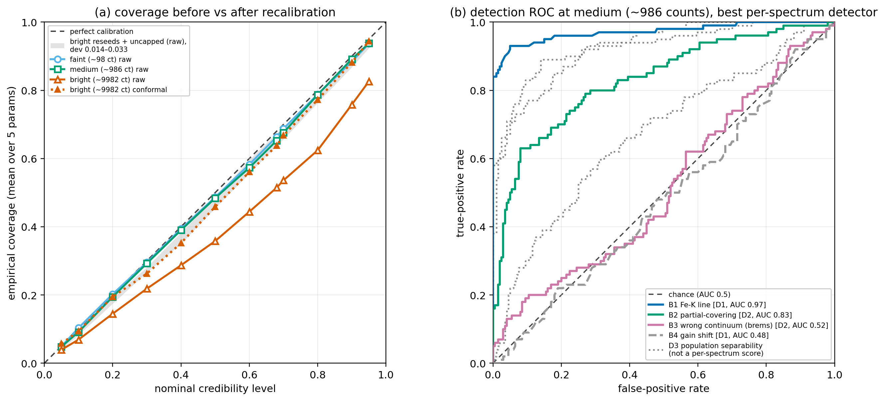
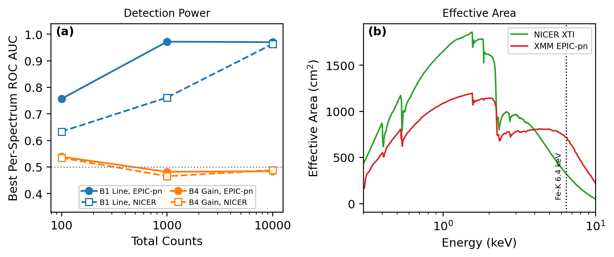
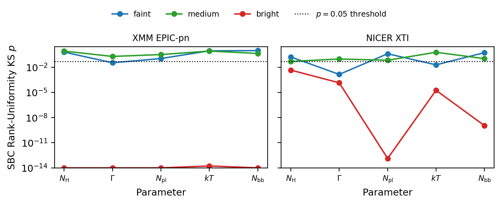

# sbi-xray-calibration

When you fit an X-ray spectrum with simulation-based inference instead of nested
sampling, you get a posterior in milliseconds instead of the minutes nested
sampling needs. What you give up is the two things nested sampling provides
automatically: a calibration guarantee and a goodness-of-fit. This repo asks, on
one real instrument response, three questions that gap raises: when can you trust
an SBI posterior for an X-ray spectrum, how do you detect when you can't, and how
much can recalibration repair? It is the first systematic misspecification-detection
benchmark for X-ray spectral SBI. The detector ideas are borrowed from the general
SBI literature; what is new here is running them as a controlled benchmark on X-ray
spectra, with the answer including a family of model errors that none of them catch.

It overlaps deliberately with Barret & Dupourqué's NPE-for-X-ray series
(Papers I–III) and with the general SBI-misspecification literature. The
contribution is the X-ray-specific benchmark and a few negative results that fall
out of it. The scope is one instrument and single-round amortized NPE (see
[Limitations](#limitations)); the numbers are reproducible from seed.



One production flow passed every recovery check yet was miscalibrated: coverage
deviation 0.114, with SBC rank histograms collapsed on all five parameters. It had
hit its training epoch cap. SBC and a coverage test flagged it, split-conformal
recalibration brought the deviation from 0.114 to 0.031, and the
importance-sampling low-ESS diagnostic fired on it. Three reseeds of the same
training, plus one retrain with the cap lifted, all come out near-calibrated
(deviation 0.014 to 0.033), so this was an undertraining artifact of one flow and
says nothing about the count regime. Recovery metrics say nothing about
calibration, so every deployed flow needs SBC and a coverage check (see
[Calibration](#calibration)). The detection results hold across seeds and are
independent of this. An unmodeled 6.4 keV Fe-K line is caught by the
posterior-predictive check with AUC 0.97 at and above ~1000 counts (line norm
above ~8×10⁻⁵); where it slips through it pulls the photon index softer by +0.20
on average at bright counts (median +0.26; at faint the shift is scatter-dominated
and slightly negative, −0.07). A detector gain shift of up to 3% gets past all
three per-spectrum trust scores at every count level (AUC ≈ 0.50) while distorting
the continuum, and nested sampling's evidence does not separate it from clean data
either once the comparison is controlled for counts (a paired test gives ΔlogZ
consistent with zero). Nested sampling earns its cost on the line, whose evidence
penalty is large (ΔlogZ ≈ −890 at bright), and on its coverage guarantee; a trust
score that catches gain shifts is an open problem.

Panel (a) is the failure case: empirical coverage (mean over the 5 marginal
parameters; since conformal recalibrates the marginals, this is marginal coverage,
joint coverage is not shown) vs nominal credibility for the one production flow
that was miscalibrated. Faint and medium sit on the diagonal; the bright raw curve
(vermilion ▲, solid) sags below it (over-confident, deviation 0.114) and
split-conformal (dotted) pulls it back to within 0.031. The shaded grey band on
the bright curve is the raw-coverage envelope of the three reseeds and the uncapped
retrain (deviation 0.014–0.033): every robustness variant lands near the diagonal,
which identifies the sagging bright curve as a single-flow training artifact.
Panel (b): detection ROC at the medium (~1000-count) level, the best per-spectrum
detector (D1/D2) per misspecification family at its strongest grid point; B4 (gain
shift) sits on the chance diagonal. D3 (dotted grey) is overlaid as a
population-separability statistic, a supervised two-sample test separate from the
per-spectrum trust scores (see the D3 footnote in [Detection](#detection)).
Colorblind-safe Okabe–Ito palette, dpi 220.

Nested sampling (UltraNest) on the exact same Poisson likelihood is ~8 800–13 000×
slower per spectrum than the amortized NPE but agrees with it to 0.04–0.10 of the
prior width on clean spectra. Its Bayesian evidence catches the Fe-K line strongly
(ΔlogZ ≈ −890 at bright), but does not separate the 3% gain shift from clean data
once counts are controlled, so the gain shift gets past the evidence check too. Full
table and the evidence-vs-detector cross-check in
[Speed vs trust](#speed-vs-trust).

## Prior work

This builds on three literatures. The X-ray-specific contribution is the
misspecification-detection benchmark (no X-ray-specific prior work found through
June 2026); the general-SBI detector ideas below predate it, and the X-ray
application and the benchmark structure are what is new.

**X-ray spectral SBI (the direct lineage).**
- **Barret & Dupourqué 2024**, A&A 686, A133 ([arXiv:2401.06061](https://arxiv.org/abs/2401.06061)), Paper I, NPE for X-ray spectra down into the Poisson regime. Our priors (N_H, Γ, kT ranges) follow their Table 1.
- **Dupourqué & Barret 2025**, A&A 699, A179 ([arXiv:2506.05911](https://arxiv.org/abs/2506.05911)), Paper II (note the author-order flip). X-IFU; finds simple summary statistics beat full-spectrum + learned compression.
- **Barret & Dupourqué 2026**, A&A 708, A280 ([arXiv:2512.16709](https://arxiv.org/abs/2512.16709)), Paper III. Autoencoder compression + sequential NPE + an importance-sampling correction that makes NPE posteriors indistinguishable from nested sampling. Our recalibration implements the same IS-refinement move with the exact Poisson likelihood, and is consistent with their framework, though the regimes differ. Their sequentially-refined proposals spend 200k–400k likelihood evaluations per spectrum across multiple rounds, which keeps the proposal close to the posterior; our single-round amortized setup uses a fixed 2000-draw IS budget and collapses to low ESS at high counts because the single-round proposal strays. The ESS collapse follows from the single-round amortization choice; the IS method itself is fine.
- **jaxspec (Dupourqué et al. 2024)**, A&A ([arXiv:2409.05757](https://arxiv.org/abs/2409.05757)), the JAX forward-modelling engine used here for all simulation.

**SBI calibration / coverage diagnostics.**
- **Talts et al. 2018** ([arXiv:1804.06788](https://arxiv.org/abs/1804.06788)), Simulation-Based Calibration (SBC), the rank-histogram test we run per parameter.
- **Hermans et al.**, TMLR 2022, *"A Crisis in Simulation-Based Inference? Beware, Your Posterior Approximations Can Be Unfaithful"* ([arXiv:2110.06581](https://arxiv.org/abs/2110.06581)), the coverage-crisis paper (cited under its retitled TMLR form); the over-confidence we isolate at high counts is exactly its concern.
- **Lemos et al. 2023**, ICML ([arXiv:2302.03026](https://arxiv.org/abs/2302.03026)), TARP expected-coverage test (we use the sbi built-in and note that its signed ATC scalar cancels at bright and hides the over-confidence; the ECP curve's abs-area / max-deviation, read directly, catches it).
- **Cranmer, Brehmer & Louppe 2020**, PNAS ([arXiv:1911.01429](https://arxiv.org/abs/1911.01429)), the SBI review framing the whole approach.
- **sbi-reloaded (Boelts et al. 2025)** ([arXiv:2411.17337](https://arxiv.org/abs/2411.17337)), the `sbi` toolkit; software citation for NPE + the SBC/TARP diagnostics.

**Misspecification detection (the detector ideas we benchmark, from the general SBI literature).**
- **Buchner et al. 2014** (BXA), A&A 564, A125 ([arXiv:1402.0004](https://arxiv.org/abs/1402.0004)), the QQ-plot model-discovery methodology; our D1/PPC KS-on-cumulative-counts sub-score is a direct descendant of that QQ/cumulative lineage.
- **Schmitt et al. 2023 / 2024** ([arXiv:2112.08866](https://arxiv.org/abs/2112.08866); extended IJCV [arXiv:2406.03154](https://arxiv.org/abs/2406.03154)), MMD on the embedding space, the methodological ancestor of our D2 embedding-OOD detector. Our D2 uses the posterior-trained, un-regularized CNN embedding, a near-sufficient summary the flow learned for inference, whereas Schmitt's method trains an MMD-regularized, deliberately overcomplete summary network specifically to make misspecification detectable. Their Eq. 12–13 give the exact reason this matters: a misspecification that preserves the summary distribution is provably invisible to any test in that summary space, which is why a gain shift, folded into the continuum parameters, evades a near-sufficient embedding. D2's weaker showing here reflects the near-sufficient embedding; it does not argue against the MMD-overcomplete approach, which is the natural next attempt (see Limitations).
- **Ward et al. 2022** (RNPE) ([arXiv:2210.06564](https://arxiv.org/abs/2210.06564)), **Cannon et al. 2022** ([arXiv:2209.01845](https://arxiv.org/abs/2209.01845)), **Huang et al. 2023** ([arXiv:2305.15871](https://arxiv.org/abs/2305.15871)), **Kelly et al. 2024** ([arXiv:2301.13368](https://arxiv.org/abs/2301.13368)), the robust-/misspecification-aware NPE cluster.
- **Anau Montel, Alvey & Weniger 2025**, PRD 111, 083013 ([arXiv:2412.15100](https://arxiv.org/abs/2412.15100)), closest methodological neighbour: local + global misspecification tests for astrophysical SBI.
- **Lopez-Paz & Oquab 2017**, Classifier Two-Sample Test (C2ST), the basis for our D3 (in the simplified marginal form, see below).

**Nested sampling (the trust baseline).**
- **Buchner 2021** (UltraNest), JOSS 6(60) 3001 ([arXiv:2101.09604](https://arxiv.org/abs/2101.09604)), the NS engine for the speed-vs-trust benchmark.
- **Buchner 2023**, *Statistics Surveys* 17, NS review ([arXiv:2101.09675](https://arxiv.org/abs/2101.09675)).
- **Buchner & Boorman 2023**, Handbook chapter *"Statistical Aspects of X-ray Spectral Analysis"* ([arXiv:2309.05705](https://arxiv.org/abs/2309.05705)), the X-ray model-checking best-practice reference, and the conceptual frame for detecting when the model is wrong.
- **Huppenkothen & Bachetti 2022**, MNRAS 511 ([arXiv:2104.03278](https://arxiv.org/abs/2104.03278)), systematic/dead-time biases in X-ray timing (cited for the point that instrument systematics bias inference, in the timing domain).

## What's in here

```
src/sbixcal/
  models.py      tbabs*powerlaw, tbabs*(powerlaw+bbody), custom Brems, B1-B3 builders
  priors.py      config-driven uniform / log-uniform prior sampling + bound checks
  responses.py   EPIC-pn obsconf loading, exposure scaling, B4 gain shift
  simulate.py    config-driven Poisson simulator, exposure calibration, npz (skip-if-exists)
  misspec.py     B1-B4 misspecification generators on strength grids
  train_npe.py   SpectrumCNN embedding, NPE+NSF builder, train loop, cold-loadable load_posterior
  calibrate.py   SBC, TARP, expected-coverage, IS-refinement, conformal recalibration
  detect.py      D1 PPC, D2 embedding-OOD, D3 marginal-C2ST detectors
  ns_bench.py    UltraNest on the reused Poisson likelihood (speed-vs-trust)
scripts/
  run_train_npe.py  run_calibration.py  run_detect_benchmark.py  run_ns_benchmark.py
  analyze_detect.py  analyze_ns_bench_countctl.py
  make_money_plot.py  make_support_figs.py  make_coverage_money_panel.py
  make_plots.py  --config configs/make_plots.yaml   (rebuild ALL figures)
  run_all.py     simulate -> train -> calibrate -> detect -> [ns_bench] -> plots
tests/  test_simulate / test_train_npe / test_calibrate / test_detect / test_ns_bench
notebooks/walkthrough.ipynb   load checkpoints + artifacts, end to end
```

The committed figures and tables under `outputs/` (coverage and detection
summary, coverage panel, detector grid, ΔΓ figure, SBC ranks, AUC/consequence
tables) let you read every number without running anything. Checkpoints, datasets
and the raw per-spectrum score dumps are gitignored (regenerable from config + seed).

### Setup: Model A, response, priors

- **Model A.** dev = `tbabs · powerlaw` (N_H, Γ, NormPL); production = `tbabs · (powerlaw + blackbody)` (N_H, Γ, NormPL, kT, NormBB). All results below are the 5-parameter production model.
- **Response.** The bundled real **XMM-Newton EPIC-pn** observation `NGC7793_ULX4_PN` (Quintin et al. 2021), 102 grouped folded channels. Total counts are set by rescaling the transfer matrix to an effective exposure (counts scale exactly linearly), giving three regimes with median total counts ≈ **100 / 1000 / 10000** over the prior.
- **Priors** follow **Barret & Dupourqué 2024 Table 1** (N_H, Γ, kT exact). Their normalization windows are tuned to NICER; the one documented deviation is that we shift the two log-uniform normalization windows down by a fixed factor and set the exposure empirically, so the three count regimes land at realistic exposures (the raw B&D windows would give 10⁴–10⁸ counts on these responses). Same widths, same log-uniform convention, see the config headers.
- **One flow per count level** (not amortized over exposure): amortizing would let the net trade information across count regimes, a confound for a calibration study (coverage is exposure-dependent). Matches Barret & Dupourqué's fixed-exposure setup.

### Misspecification families (B1–B4)

Each runs on a strength grid; the weakest grid point reproduces clean Model A as
a control.

- **B1**, unmodeled narrow Gaussian (Fe-K) line at 6.4 keV; grid = line norm (≈ equivalent width).
- **B2**, `Tbpcf` partial-covering absorber replacing `tbabs`; grid = covering fraction f (f=1 ≈ clean).
- **B3**, continuum-family swap, powerlaw → a custom analytic thermal bremsstrahlung (`M(E)=K·E⁻¹·exp(−E/kT)`, with the Gaunt factor dropped, an acceptable approximation for a misspecification template; jaxspec has no apec/bremss, and the custom-component path worked, so it is used instead of the pre-approved Diskbb fallback). Grid = kT.
- **B4**, detector gain shift, applied by rescaling the response's unfolded energy grid in place (no RMF FITS rewrite); grid = gain percent. See `docs/gain_shift_notes.md`.

## Calibration

One trained production flow was miscalibrated despite passing every
recovery-quality check (mean Pearson r 0.84, all five posteriors shrinking
monotonically with counts): it under-covered badly, and only the calibration
toolkit caught it. That flow had hit its 150-epoch training cap with a train/val
gap (−14.91 / −13.36), so its posteriors narrowed faster than they stayed
accurate, and its rank histograms went ∪-shaped (truth in the tails too often),
the textbook over-confidence signature:

| level  | ~counts | raw mean‖dev‖ | SBC KS p (N_H, Γ, normPL, kT, normBB) | coverage @ 50/68/90 (raw) |
|--------|---------|---------------|----------------------------------------|----------------------------|
| faint  | 98      | 0.014         | 0.66, 0.03, 0.11, 0.93, 0.98 (pass)    | 0.49 / 0.66 / 0.88         |
| medium | 986     | 0.018         | 0.86, 0.19, 0.32, 0.86, 0.45 (pass)    | 0.48 / 0.65 / 0.89         |
| bright (this flow) | 9982 | **0.114** | **0, 1e−21, 0, 2e−14, 6e−40 (fail 5/5)** | **0.36 / 0.51 / 0.76** |

SBC and the coverage test flagged the flow; split-conformal recalibration is the
effective fix (0.36/0.51/0.76 → 0.46/0.64/0.88; deviation 0.114 → 0.031); and the
IS-refinement low-ESS flag fired on it (~97% of cases trip it, median ESS ≈ 18 of
2000 draws), because a sharp, slightly-misplaced single-round proposal gives
importance weights dominated by a handful of samples. That is the flag working:
Paper III avoids the regime with sequential rounds (200k–400k likelihood
evaluations per spectrum to keep the proposal near the posterior); our 2000-draw
single-round budget is consistent with their IS framework but in the opposite
regime, so the ESS collapse is expected. For a flow in this state, conformal
recalibration (or a fall back to NS) restores coverage.

A robustness pass shows this is a single-flow artifact. Reseeding the bright
training under three new seeds, and retraining one variant on the same data with
the epoch cap lifted from 150 to 400, gives near-calibrated flows every time (raw
coverage deviation **0.014–0.033**; SBC still flags two of the three reseeds). The cleanest control is the
uncapped retrain: identical data, cap lifted, converged at 162 epochs → deviation
0.014, SBC uniform. That isolates the cause as undertraining / the epoch cap, not
the count regime:

| variant | epochs (cap) | raw cov dev | SBC ks_p_min |
|---|---|---|---|
| production (orig.) | 151 / 150 (cap hit) | **0.114** | ≈ 0 (5/5 fail) |
| reseed 101 / 202 / 303 | 83 / 151 / 116 | 0.033 / 0.031 / 0.022 | 0.084 / 1e−8 / 0.016 (202: 4/5, 303: 2/5 fail) |
| **uncapped** | 162 / 400 (converged) | **0.014** | 0.028 (1/5 fail) |

The operational point: a flow can pass recovery checks and still be miscalibrated,
so SBC and a coverage test should be run on every flow before deployment. For
context, Barret & Dupourqué I (arXiv:2401.06061 §3.2–3.3) recover excellently at
10⁴–10⁵ counts with a deliberately restricted prior and never run a rank-based SBC
test; the rank-based calibration test is what this repo adds.

**TARP: the signed area summary hides the over-confidence; read the curve.** A
common shortcut is to read TARP's single signed area-to-curve (ATC) number. At
bright that number is misleadingly benign: ATC ≈ **−0.002** (recomputed from
`outputs/calibration/bright/tarp.npz`), apparently fine. The signed area cancels
because the bright ECP curve bows above the diagonal at α < 0.5 and below it at
α > 0.5 (mean ECP−α = +0.080 for α<0.5, −0.004 for α>0.5); the two lobes nearly
annihilate in a signed integral. The unsigned summary tells the truth: the bright
ECP curve's **abs-area is 0.053** and its **max|ECP−α| = 0.102 at α ≈ 0.19**,
versus abs-areas of only 0.005 / 0.012 at faint / medium. TARP does catch the
over-confidence if you read the curve (or use abs-area / a KS statistic); the
signed ATC alone hides it. The committed bright ECP curve makes this visible:
`outputs/diagnostics/tarp_bright_curve.png`.

SBC rank histograms: `outputs/calibration/{faint,medium,bright}/sbc_ranks.png`.
Coverage panel: `outputs/diagnostics/coverage_money_panel.png`. Recovery scatters:
`outputs/diagnostics/npe_recovery_*.png`. Bright TARP ECP curve (the
read-the-curve figure): `outputs/diagnostics/tarp_bright_curve.png`.

## Detection

A 144-cell ROC grid (4 families × 4-strength grids × 3 count levels × 3
detectors). Two of the three detectors answer different questions and must not be
read on the same axis (see the D3 footnote below): D1/D2 are per-spectrum
unlabeled novelty scores (given one spectrum, how suspicious is it?), while
D3/marginal-C2ST is a population separability statistic (given two labeled
populations, clean vs misspecified, how distinguishable are their embeddings?). D3
is therefore tabulated in a separate column group and is not treated as a
per-spectrum result.

Best ROC AUC per (level, family) among the per-spectrum detectors (D1/D2), and
separately the D3 population-separability AUC:

| level  | B1 (D1/D2)        | B2 (D1/D2)        | B3 (D1/D2)        | B4 (D1/D2)      ‖ | B1 (D3)† | B2 (D3)† | B3 (D3)† | B4 (D3)† |
|--------|-------------------|-------------------|-------------------|------------------|----------|----------|----------|----------|
| faint  | 0.76 (D1)         | 0.67 (D2)         | 0.56 (D1)≈chance  | 0.58 (D1)≈chance | 0.80     | 0.81     | 0.71     | 0.53     |
| medium | **0.97 (D1)**     | 0.83 (D2)         | 0.54 (D1)≈chance  | 0.51 (D2)≈chance | 0.92     | 0.93     | 0.77     | 0.54     |
| bright | **0.97 (D1)**     | 0.84 (D2)         | 0.66 (D2)         | 0.51 (D2)≈chance | 0.89     | 0.96     | 0.81     | 0.53     |

† D3 is a population-separability (supervised two-sample) statistic, not a
per-spectrum trust score. It trains a supervised classifier on each cell's labeled
clean-vs-misspec embedding populations; its "per-spectrum score" is the out-of-fold
class-1 probability of that supervised classifier, measuring how separable the two
populations are. Its control-cell floor is ~0.66 CV-accuracy on cells with no real
misspecification (e.g. the weakest B1 line, norm 5e-6, a negligible
perturbation): there D3 reports cv-accuracy ≈ 0.66 while its ROC AUC sits at ≈
0.43–0.54 (at/below chance). Every D3 number should be read against that ~0.66
cv-accuracy / ~0.5-AUC null, not against 0.5. D3's value is the population
question; it does not transfer to deciding whether a single unlabeled spectrum is
trustworthy.

Given labeled populations, the embedding space separates B2 and B3 (D3). Given a
single unlabeled spectrum, only the PPC flags lines (D1), and nothing flags gain
shifts. An X-ray analyst works one spectrum at a time, so the per-spectrum result
is the relevant one.

Full grid: `outputs/detect/auc_table.md`; heatmap:
`outputs/diagnostics/detector_auc_grid.png`.

- **B1 (unmodeled Fe-K line):** the per-spectrum PPC (D1) catches it at ≥1000 counts (AUC 0.97), because the line adds localized counts the posterior-predictive check cannot reproduce. At ~100 counts shot noise buries it (best per-spectrum AUC 0.76; D3's 0.80 is the population statistic). Where the line slips through it biases Γ softer, and the signed bias grows with counts: +0.10 at medium, **+0.20 mean / +0.26 median (mean |ΔΓ| 0.46) at bright** for the strongest line (`outputs/diagnostics/dgamma_silent_failure.png`, `outputs/detect/consequence.md`).
- **B2 (partial covering):** among the per-spectrum detectors, the embedding-OOD (D2) is the one that gets lift (0.67/0.83/0.84 > PPC's 0.59/0.64/0.78), because a covering fraction reshapes the whole soft continuum, a global distortion the embedding sees better than the channel-wise PPC. The population test (D3) separates it best (0.81/0.93/0.96 with counts), though that is supervised two-sample separability and not a per-spectrum trust score. The f≈0.9 near-chance behaviour is a weak leak absorbed into N_H, not an anomalous inversion, and AUC rises monotonically as the leak grows.
- **B3 (wrong continuum family):** only the population test (D3) gets meaningful lift (0.71–0.81); per-spectrum detectors stay near chance (best D1/D2 0.54–0.66). At the kT where brems looks most powerlaw-like, the 5-parameter model absorbs the difference into N_H/Γ/blackbody: a silent continuum-family error for any per-spectrum trust score.
- **B4 (detector gain shift):** not detectable by any detector at any level. All 36 B4 cells span AUC 0.43–0.58 (mean 0.50), flat in counts and in gain strength. D3's population separability is no exception (0.53–0.54, at its ~0.66 cv-accuracy control floor). A gain shift preserves spectral shape (it slides the energy axis by up to 3%), so the NPE folds it into the continuum parameters. The embedding-OOD detector does not catch it either (D2 on B4 = 0.48–0.54), against the initial expectation that it would. Gain miscalibration stays invisible to all three trust scores while distorting the continuum, and a per-spectrum score that catches it remains an open problem.
- **D2** adds value beyond D1 on one family: it leads on B2 (where D1 lags), is second to D1 on B1, and is at or below chance on B3/B4. It is the literature's embedding-OOD detector benchmarked on X-ray for the first time.

The detectors, briefly: **D1 PPC** (per-spectrum, unlabeled) draws θ∼q(·|x), folds
through the same EPIC-pn response, Poisson-realizes replicates, and scores a
χ²-on-binned-counts and a KS-on-cumulative-counts discrepancy (the Buchner+14 QQ
descendant). **D2** (per-spectrum, unlabeled) is the embedding-space Mahalanobis /
k-NN OOD distance (k-NN is primary; Mahalanobis whitening amplifies the huge
log-uniform brightness axis and washes out the signal). **D3 is the simplified
marginal C2ST**, a population-separability (supervised two-sample) statistic and
not a per-spectrum trust score: a per-cell CV classifier supervised on the cell's
labeled clean-vs-misspec embedding populations, whose per-spectrum number is the
classifier's out-of-fold class-1 probability. Because it is supervised on
population labels it has a control-cell floor of ~0.66 cv-accuracy even where there
is no real misspecification (e.g. a negligible 5e-6 line) while its AUC there ≈
0.43–0.54; that is its null, and every D3 number must be read against it. It is not
the per-spectrum conditional C2ST: that variant was found pathological against the
over-confident NPE posteriors (a tight replicate cluster is trivially separable from
the broad clean cloud for clean and misspecified spectra alike, so its AUC carried
no signal). The simplified marginal version is what is implemented here, and it is
labeled as such everywhere it appears.

## Speed vs trust

The NS benchmark runs UltraNest on the exact same Poisson likelihood the
IS-refinement uses (a unit test asserts they agree on logL to 1e-9), recording
per-spectrum NS quantiles / logZ / wall-clock vs the amortized NPE on a 76-spectrum
subsample (56 clean Model-A across the three count levels + B1 line and B4 gain
spectra at medium/bright). Two questions: how much do you pay for the trust NS
gives you, and does NS's Bayesian evidence catch the misspecifications the
per-spectrum trust scores miss?

**Speed vs agreement (clean Model-A spine).** NS is ~8 800–13 000× slower per
spectrum than the amortized NPE, and where the NPE is calibrated its quantiles
agree with NS to **0.04–0.10 of the prior width**. On clean spectra the flow is
posterior-equivalent to NS at ~10⁴× lower cost.

| level | ~counts | n | NS s/spec | NS n_like_evals | NPE ms/spec | NS/NPE speedup | q-agreement (mean \|Δq\|/width) |
|---|---|---|---|---|---|---|---|
| faint  | 47   | 25 | 1065.5 | 49 878 | 83  | 12 802× | 0.068 |
| medium | 540  | 16 |  941.2 | 52 463 | 106 |  8 864× | 0.037 |
| bright | 7910 | 15 | 1751.4 | 95 386 | 177 |  9 882× | 0.100 |

NS 90% intervals contain the truth on 0.85–0.91 of params per level (a sanity
coverage proxy). Caps and trust signals, accounted:
- **Non-converged (capped) rows:** the live run uses `--max-ncalls 120000` (a CLI override of the config's 400 000) to bound the heavy-tailed high-count tail: the log-uniform `norm` prior makes some draws unexpectedly high-count, giving a very tight Poisson posterior that UltraNest is slow to localize. **12 of 76 rows hit that cap** (`n_like_evals ≥ 120 000`): 11 clean (2 faint, 2 medium, 7 bright) + 1 B4-bright. A capped row's `logZ` is a lower bound, never compared against a converged `logZ`; the speed/agreement numbers above still stand (quantiles from a near-cap run are indicative).
- **NPE rejection-sampling fallback (a trust signal in its own right):** sampling the flow with `reject_outside_prior=True` can stall when a misspecified spectrum pushes flow mass outside the prior box (observed worst on B4-bright). The harness bounds this at 120 s and falls back to raw flow samples, flagging the row (`rejection_timeout`). Flow mass leaking outside the prior on a misspecified spectrum is itself evidence the model is wrong, so it is surfaced. **0 rows tripped the timeout in the committed run** (the bound is a guard; the worst B4-bright cases sampled within budget here).

**Read the evidence against total counts.** logZ is the log marginal likelihood of
one dataset, so its size scales with counts: on the clean spectra
logZ ≈ −117·log10(counts) + 91 (r = −0.99). A count `level` spans ~30× in counts, so
a raw `mean(logZ_misspec − logZ_clean)` over two unmatched sets of spectra is
dominated by their difference in counts. We instead fit the clean
logZ–log10(counts) trend and report each cell's residual from it: below the trend is
a real penalty, on the trend is none.

| family | strength | level | n | ΔlogZ (count-controlled) [95% CI] | D1 AUC | D2 AUC | D3 AUC | verdict |
|---|---|---|---|---|---|---|---|---|
| B1 Fe-K line | 3e-4 | bright | 6 | **−892** [−1166, −562] | 0.970 | 0.810 | 0.893 | NS **and** detectors flag it |
| B1 Fe-K line | 3e-4 | medium | 6 | **−67** [−90, −44] | 0.972 | 0.846 | 0.917 | both flag it |
| B4 gain shift | 3%  | medium | 4 | **+13** [+3, +26] | 0.482 | 0.477 | 0.456 | no penalty; detectors at chance |
| B4 gain shift | 3%  | bright | 4 | **−3** [−16, +11] | 0.474 | 0.484 | 0.446 | no penalty; detectors at chance |

The Fe-K line sits far below the clean trend at both levels (bootstrap intervals well
clear of zero, Table above), where the posterior-predictive check also fires. The 3% gain shift sits on the trend: its
count-controlled residual is not a drop below it, and a paired test (the same
spectrum folded through the clean and the gain-shifted response at matched exposure and
Poisson seed, so counts are near-identical) gives ΔlogZ consistent with zero. So the gain shift gets past
the evidence check the same way it gets past the cheap scores. The mechanism is the
one Buchner's X-ray model-checking line is built on: an evidence / goodness-of-fit
test asks whether any parameter setting of the model explains the data, which a
posterior-only novelty score (asking only whether a draw is far from the clean cloud)
cannot. A 6.4 keV line cannot be explained by any continuum parameters, so logZ drops;
a gain shift, on a near-scale-invariant continuum, is absorbed into Γ and the
normalizations, so logZ holds. This is Buchner+14's BXA evidence-comparison
methodology and the model-discovery framing of Buchner & Boorman 2023: nested sampling
earns its cost on the line and on the coverage guarantee, and an evidence-based check
(NS / BXA) in the loop still catches the misspecifications that have spectral shape.

The per-spectrum dumps and the count-controlled analysis are regenerated by
`scripts/analyze_ns_bench_countctl.py` from `outputs/ns_bench/results.jsonl`.

## Second instrument: NICER

The whole benchmark also runs on the NICER XTI response, the instrument the priors
were built on. Fetch the public on-axis response first
(`python scripts/fetch_nicer_response.py`), then point any config at it with
`response: NICER` (the `*_nicer.yaml` configs mirror the XMM ones). The two central
results reproduce.



- **The gain shift stays invisible.** All 36 B4 cells span AUC 0.41–0.57 (mean 0.49),
  the same at-chance behaviour as EPIC-pn.
- **The line is caught, with an instrument-dependence.** The posterior-predictive AUC
  reaches 0.96 at ~10 000 counts, but the line is weaker at lower counts than on
  EPIC-pn (0.76 vs 0.97 at ~1000 counts). NICER's effective area at 6.4 keV is ~6×
  below its 1.5 keV peak and below EPIC-pn's at that energy (panel b), so at matched
  total counts fewer photons land near the line. Line detectability tracks the
  effective area at the line energy; the gain-shift invisibility does not.

The high-count SBC failure also reproduces: the bright flow fails rank-uniformity on
every parameter on both responses, while faint and medium mostly pass, so it is the
count regime and not one flow's training.



## Limitations

1. **Single instrument response.** Everything is one bundled XMM-Newton EPIC-pn observation. The calibration trend and the detection AUCs are response-specific; a different effective-area curve / channel grid would shift the numbers.
2. **Single-round amortized NPE.** No sequential rounds (Paper III's regime). This is why the IS-refinement is ESS-starved at high counts. A deliberate scope choice; it means the ESS behaviour reflects the amortization setup, and is not a property of the IS method.
3. **B3 brems is Gaunt-free analytic.** The B3 continuum is `K·E⁻¹·exp(−E/kT)` with the slowly-varying Gaunt factor dropped. Adequate as a wrong-continuum-family template, and not a calibrated plasma model. A real apec/bremss comparison would need PyXspec on the VM.
4. **D3 is the simplified marginal C2ST**, not the conditional per-spectrum C2ST (which was pathological here; see above). It is a population-level test, separate from the per-spectrum detectors.
5. **Gain shifts are undetectable by these three detectors. This is an open problem.** B4 is at chance for D1/D2/D3 at all levels. The scope matters: D2 uses the flow's near-sufficient posterior-trained embedding, and Schmitt et al.'s Eq. 12–13 show that a misspecification which preserves the summary distribution is provably invisible to any test in that summary space, which is exactly what a gain shift does once the NPE folds it into the continuum parameters. The natural next attempt is an MMD-regularized, deliberately overcomplete summary network (Schmitt+23/24) trained to make such shifts detectable, or a detector that explicitly models the response energy-scale calibration.
6. **Counts are controlled via the prior + exposure**, with a heavy-tailed log-uniform norm; the median count is the calibrated, stable target. Per-spectrum counts vary widely within a "level".

## Reproduce

```powershell
# from the repo root, with the venv python; cap compute as needed
$env:OMP_NUM_THREADS = 4
.venv\Scripts\python.exe -m pip install -e . --no-deps      # one-time editable install

# full pipeline (each stage skip-if-exists; NS is opt-in via --with-ns)
.venv\Scripts\python.exe scripts\run_all.py

# rebuild every figure from local pipeline outputs (requires the pipeline to have been run)
.venv\Scripts\python.exe scripts\make_plots.py --config configs\make_plots.yaml

# individual stages
.venv\Scripts\python.exe scripts\run_train_npe.py     --config configs\train_npe_prod.yaml
.venv\Scripts\python.exe scripts\run_calibration.py   --config configs\calibration.yaml
.venv\Scripts\python.exe scripts\run_detect_benchmark.py --config configs\detect.yaml
.venv\Scripts\python.exe scripts\analyze_detect.py    --config configs\detect.yaml

# tests
.venv\Scripts\python.exe -m pytest -q
```

Everything is reproducible from config + a fixed global seed (`20260611`).
Expensive artifacts are checkpointed with skip-if-exists; `data/` is empty and
rebuildable; no data or checkpoints are committed. Python 3.12, native Windows;
`sbi` (NPE+NSF), `jaxspec` (CPU JAX), `ultranest`, `arviz`.

## Author

Karan Akbari, MSc Astrophysics, St. Xavier's College Mumbai. Background in X-ray
timing and spectral analysis of black-hole X-ray binaries (GRS 1915+105,
4U 1630−47) with Dr. Sudip Bhattacharyya at TIFR.
